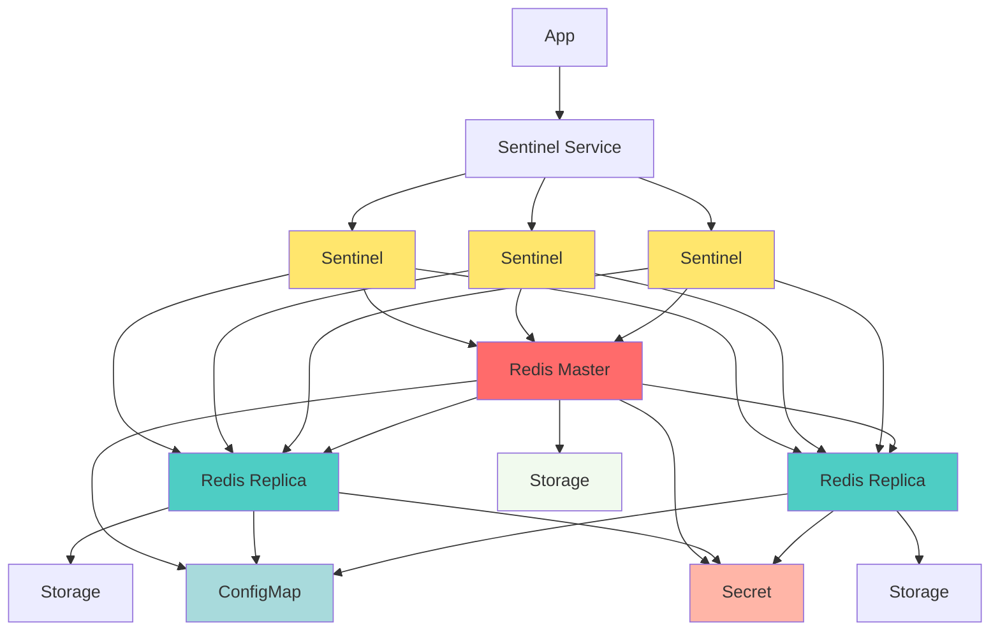

# Redis Sentinel Helm Chart


A production-ready Helm chart for deploying highly available Redis clusters with Sentinel for automatic failover in Kubernetes and OpenShift.

---

## Features

* **Automatic Failover**: Redis Sentinel handles master failures without manual intervention
* **High Availability**: 3+ Redis instances with 3+ Sentinel monitors
* **Production Ready**: Pod disruption budgets, anti-affinity rules, and resource management
* **Secure by Default**: Password authentication and configurable security contexts
* **Persistent Storage**: Optional persistent volumes for data durability
* **OpenShift Compatible**: Works with Security Context Constraints
* **Easy Integration**: Standard Redis client libraries support Sentinel mode

---

## Quick Start

### Install with Default Settings

```bash
# Add Helm repository
helm repo add redis-cluster https://github.com/City-of-Helsinki/coh-helm-charts
helm repo update

# Install the chart
helm install my-redis redis-cluster/redis-cluster
```

### Install with Custom Password

```bash
helm install my-redis redis-cluster/redis-cluster \
  --set redis.password.password=mySecurePassword123
```

### Install from Source

```bash
git clone https://github.com/City-of-Helsinki/coh-helm-charts
cd charts/redis-cluster
helm install my-redis . -f values.yaml
```

---

## Architecture

This chart deploys a complete Redis Sentinel cluster with all necessary resources. StatefulSets provide stable network identities for Redis and Sentinel pods, while init containers handle dynamic configuration and replication setup. Applications connect to the Sentinel service to discover the current master.



### Components Deployed

* **Redis StatefulSet**: 3 pods (1 master, 2 replicas) with persistent storage
* **Sentinel StatefulSet**: 3 pods monitoring Redis cluster health
* **Headless Services**: Enable DNS-based pod discovery
* **ClusterIP Service**: Single endpoint for Sentinel queries
* **ConfigMaps**: Redis and Sentinel configuration files
* **Secret**: Redis password (auto-generated or existing)
* **PodDisruptionBudgets**: Prevent too many pods down simultaneously (optional)

---

## Prerequisites

* Kubernetes 1.19+ or OpenShift 4.x+
* Helm 3.0+
* PersistentVolume provisioner (if persistence enabled)
* 3+ worker nodes recommended for pod distribution

---

## Configuration Examples

see values.yaml

## Application Integration

Applications connect to Redis through Sentinels for automatic master discovery. This ensures applications always connect to the current master, even after failovers.

### Connection Pattern

1. Application queries Sentinel service for master address
2. Sentinel returns current master location
3. Application connects directly to master Redis
4. If connection fails, application re-queries Sentinel

### Service DNS Names

After installation, use these DNS names within the cluster:

* **Sentinel Service**: `<release-name>-sentinel.<namespace>.svc.cluster.local:5000`
* **Redis Headless**: `<release-name>-redis-0.<release-name>-headless.<namespace>.svc.cluster.local:6379`

Example for release "my-redis" in "default" namespace:
* Sentinel: `my-redis-sentinel.default.svc.cluster.local:5000`
* Redis Master: `my-redis-redis-0.my-redis-headless.default.svc.cluster.local:6379`

---

### Update Configuration

Modify Redis or Sentinel configuration without reinstalling.

```bash
# Update Redis memory limit
helm upgrade my-redis redis-cluster/redis-cluster \
  --set redis.config.maxmemory=2gb \
  --reuse-values
```

---

## Configuration Reference

## **Global Settings**

| Parameter | Description | Default |
|----------|-------------|---------|
| `podSecurityContext.enabled` | Enable pod security context | `false` |
| `podSecurityContext.runAsUser` | User ID for pod | `""` |
| `podSecurityContext.runAsGroup` | Group ID for pod | `""` |
| `podSecurityContext.fsGroup` | FS group for pod | `""` |
| `podSecurityContext.fsGroupChangePolicy` | FS group change policy | `"OnRootMismatch"` |
| `nodeSelector` | Node labels | `{}` |
| `tolerations` | Tolerations | `[]` |
| `affinity.enabled` | Enable pod anti-affinity | `true` |

---

## **Redis Configuration**

### **Basic Settings**

| Parameter | Description | Default |
|----------|-------------|---------|
| `redis.replicaCount` | Number of Redis instances | `3` |
| `redis.image` | Redis image | `registry.redhat.io/rhel9/redis-7@sha256:3d31c0cfaf4219f5bd1c52882b603215d1cb4aaef5b8d1a128d0174e090f96f3` |
| `redis.securityContext.enabled` | Enable security context | `false` |

---

### **Resources**

| Parameter | Description | Default |
|----------|-------------|---------|
| `redis.resources.requests.cpu` | CPU request | `100m` |
| `redis.resources.requests.memory` | Memory request | `256Mi` |
| `redis.resources.limits.cpu` | CPU limit | `""` |
| `redis.resources.limits.memory` | Memory limit | `512Mi` |

---

### **Persistence**

| Parameter | Description | Default |
|----------|-------------|---------|
| `redis.persistence.enabled` | Enable PVC | `true` |
| `redis.persistence.size` | PVC size | `8Gi` |
| `redis.persistence.storageClass` | Storage class | `""` |

---

### **Password & Security**

| Parameter | Description | Default |
|----------|-------------|---------|
| `redis.password.password` | Redis password | `""` (auto-generated) |
| `redis.password.existingSecret` | Secret name | `""` |
| `redis.password.secretKey` | Secret key | `redis-password` |

---

### **Pod Disruption Budget**

| Parameter | Description | Default |
|----------|-------------|---------|
| `redis.pdb.enabled` | Enable PDB | `false` |
| `redis.pdb.minAvailable` | Min available pods | `1` |
| `redis.pdb.maxUnavailable` | Max unavailable | `""` |
| `redis.pdb.annotations` | Annotations | `{}` |

---

### **Redis Config (`redis.conf`)**

| Parameter | Description | Default |
|----------|-------------|---------|
| `redis.config.bind` | Bind address | `0.0.0.0` |
| `redis.config.protectedMode` | Protected mode | `yes` |
| `redis.config.port` | Port | `6379` |
| `redis.config.timeout` | Client timeout | `500` |
| `redis.config.tcpKeepalive` | TCP keepalive | `300` |
| `redis.config.tcpBacklog` | TCP backlog | `511` |
| `redis.config.requirepass` | Password | `""` |
| `redis.config.daemonize` | Daemonize | `no` |
| `redis.config.supervised` | Supervised mode | `no` |
| `redis.config.pidfile` | PID file | `/var/run/redis_6379.pid` |
| `redis.config.loglevel` | Log level | `notice` |
| `redis.config.logfile` | Log file path | `""` |
| `redis.config.databases` | Databases count | `16` |
| `redis.config.maxmemory` | Max memory | `900mb` |
| `redis.config.maxmemoryPolicy` | Eviction policy | `allkeys-lru` |
| `redis.config.save` | RDB save intervals | `""` |
| `redis.config.appendonly` | Enable AOF | `no` |
| `redis.config.stopWritesOnBgsaveError` | Stop writes on BGSAVE error | `no` |
| `redis.config.rdbcompression` | RDB compression | `yes` |
| `redis.config.rdbchecksum` | RDB checksum | `yes` |
| `redis.config.rdbDelSyncFiles` | Delete sync files | `no` |
| `redis.config.replicaServeStaleData` | Serve stale data | `yes` |
| `redis.config.replicaReadOnly` | Replica read-only | `yes` |
| `redis.config.replDisklessSync` | Diskless sync | `no` |
| `redis.config.replDisklessSyncDelay` | Sync delay | `5` |
| `redis.config.replDisklessLoad` | Diskless load | `disabled` |
| `redis.config.replDisableTcpNodelay` | Disable NODELAY | `no` |
| `redis.config.replicaPriority` | Replica priority | `100` |
| `redis.config.acllogMaxLen` | ACL log length | `128` |
| `redis.config.alwaysShowLogo` | Always show logo | `yes` |
| `redis.config.dir` | Data dir | `/data` |
| `redis.extraConfig` | Extra config | `{}` |

---

### **Redis Service**

| Parameter | Description | Default |
|----------|-------------|---------|
| `redis.service.port` | Service port | `6379` |
| `redis.service.targetPort` | Container port | `6379` |

---

## **Sentinel Configuration**

### **Basic Settings**

| Parameter | Description | Default |
|----------|-------------|---------|
| `sentinel.replicaCount` | Sentinel instances | `3` |
| `sentinel.image` | Sentinel image | `registry.redhat.io/rhel9/redis-7@sha256:3d31c0cfaf4219f5bd1c52882b603215d1cb4aaef5b8d1a128d0174e090f96f3` |
| `sentinel.securityContext.enabled` | Enable security context | `false` |

---

### **Resources**

| Parameter | Description | Default |
|----------|-------------|---------|
| `sentinel.resources.requests.cpu` | CPU request | `50m` |
| `sentinel.resources.requests.memory` | Memory request | `128Mi` |
| `sentinel.resources.limits.cpu` | CPU limit | `""` |
| `sentinel.resources.limits.memory` | Memory limit | `256Mi` |

---

### **Sentinel Pod Disruption Budget**

| Parameter | Description | Default |
|----------|-------------|---------|
| `sentinel.pdb.enabled` | Enable PDB | `false` |
| `sentinel.pdb.minAvailable` | Min available | `1` |
| `sentinel.pdb.maxUnavailable` | Max unavailable | `""` |
| `sentinel.pdb.annotations` | Annotations | `{}` |

---

### **Sentinel Config**

| Parameter | Description | Default |
|----------|-------------|---------|
| `sentinel.config.port` | Sentinel port | `26379` |
| `sentinel.config.masterName` | Redis master name | `mymaster` |
| `sentinel.config.quorum` | Failover quorum | `2` |
| `sentinel.config.downAfterMilliseconds` | Down detection | `5000` |
| `sentinel.config.failoverTimeout` | Failover timeout | `10000` |
| `sentinel.config.parallelSyncs` | Parallel syncs | `1` |
| `sentinel.config.resolveHostnames` | Resolve hostnames | `yes` |
| `sentinel.config.announceHostnames` | Announce hostnames | `yes` |
| `sentinel.extraConfig` | Extra config | `{}` |

---

### **Sentinel Service**

| Parameter | Description | Default |
|----------|-------------|---------|
| `sentinel.service.type` | Service type | `ClusterIP` |
| `sentinel.service.port` | Service port | `5000` |
| `sentinel.service.targetPort` | Container port | `26379` |

---

## **Probes**

### **Redis Probes**

| Parameter | Description | Default |
|----------|-------------|---------|
| `probes.redis.liveness.initialDelaySeconds` | Initial delay | `10` |
| `probes.redis.liveness.timeoutSeconds` | Timeout | `5` |
| `probes.redis.liveness.periodSeconds` | Period | `5` |
| `probes.redis.liveness.failureThreshold` | Failure threshold | `10` |
| `probes.redis.readiness.initialDelaySeconds` | Initial delay | `5` |
| `probes.redis.readiness.timeoutSeconds` | Timeout | `15` |
| `probes.redis.readiness.periodSeconds` | Period | `2` |
| `probes.redis.readiness.successThreshold` | Success threshold | `2` |
| `probes.redis.readiness.failureThreshold` | Failure threshold | `40` |

---

### **Sentinel Probes**

| Parameter | Description | Default |
|----------|-------------|---------|
| `probes.sentinel.liveness.initialDelaySeconds` | Initial delay | `10` |
| `probes.sentinel.liveness.timeoutSeconds` | Timeout | `5` |
| `probes.sentinel.liveness.periodSeconds` | Period | `5` |
| `probes.sentinel.liveness.failureThreshold` | Failure threshold | `10` |
| `probes.sentinel.readiness.initialDelaySeconds` | Initial delay | `5` |
| `probes.sentinel.readiness.timeoutSeconds` | Timeout | `10` |
| `probes.sentinel.readiness.periodSeconds` | Period | `2` |
| `probes.sentinel.readiness.failureThreshold` | Failure threshold | `20` |

---

## **Init Scripts**

| Parameter | Description | Default |
|----------|-------------|---------|
| `scripts.redisInit` | Redis init script | `scripts/redis_init.sh` |
| `scripts.sentinelInit` | Sentinel init script | `scripts/sentinel_init.sh` |
---

## Upgrading

Upgrade the Helm release to apply configuration changes or update to a new chart version.

```bash
# Upgrade with new values file
helm upgrade my-redis redis-cluster/redis-cluster -f new-values.yaml

# Upgrade to specific chart version
helm upgrade my-redis redis-cluster/redis-cluster --version 1.1.0

# Upgrade single parameter
helm upgrade my-redis redis-cluster/redis-cluster \
  --set redis.resources.limits.memory=1Gi \
  --reuse-values
```

The chart uses StatefulSets with RollingUpdate strategy, upgrading one pod at a time. Sentinels automatically handle failover if the master is restarted during upgrade.

---

## Uninstalling

Remove the Helm release and optionally clean up persistent data.

```bash
# Delete the release
helm uninstall my-redis

# Delete PVCs (if persistence was enabled)
oc delete pvc -l app.openshift.io/instance=my-redis

# Verify cleanup
oc get all,pvc -l app.openshift.io/instance=my-redis
```

---

## Troubleshooting

### Pods Not Starting

Check init container logs for configuration errors, verify security context permissions, and ensure PVCs are bound.

```bash
# Check pod status and events
oc get pods -l app.openshift.io/instance=my-redis
oc describe pod my-redis-redis-0

# Check init container logs
oc logs my-redis-redis-0 -c config

# Check main container logs
oc logs my-redis-redis-0

# Verify PVC status
oc get pvc
```

Common causes: incorrect security context, resource constraints, storage provisioning failures, image pull errors.

### Master Not Detected

Verify password configuration, check network connectivity, and confirm Sentinel configuration.

```bash
# Check Sentinel status
oc exec my-redis-sentinel-0 -- redis-cli -p 26379 SENTINEL masters

# Verify password in secret
oc get secret my-redis-secret -o jsonpath='{.data.redis-password}' | base64 -d

# Test connectivity
oc exec my-redis-sentinel-0 -- \
  redis-cli -h my-redis-redis-0.my-redis-headless -p 6379 -a <password> PING
```

Common causes: password mismatch, network policies blocking traffic, incorrect ConfigMap settings.

### Frequent Failovers

Increase detection timeouts, verify resource allocation, and check network stability.

```bash
# Check Sentinel logs for failover patterns
oc logs my-redis-sentinel-0 | grep -i failover

# Increase timeout
helm upgrade my-redis redis-sentinel/redis-sentinel \
  --set sentinel.config.downAfterMilliseconds=10000 \
  --reuse-values

# Increase resources
helm upgrade my-redis redis-sentinel/redis-sentinel \
  --set redis.resources.limits.memory=2Gi \
  --reuse-values
```

Common causes: aggressive timeouts, master resource exhaustion, network latency, node instability.

### Replication Lag

Monitor replication offset and increase replica resources if needed.

```bash
# Check replication status
oc exec my-redis-redis-0 -- redis-cli -a <password> INFO replication

# Check replica offset
oc exec my-redis-redis-1 -- redis-cli -a <password> INFO replication
```

Solutions: scale up replica resources, increase network bandwidth, reduce write load, enable diskless replication.

---

## Best Practices

### Security

* Always use strong passwords stored in openshift secrets
* Never commit passwords to version control
* Enable TLS for production environments (requires cert-manager)
* Use network policies to restrict pod communication
* Run containers as non-root users with security contexts
* Regularly rotate passwords

### High Availability

* Deploy minimum 3 Redis instances (1 master + 2 replicas)
* Deploy exactly 3 or 5 Sentinel instances (odd number for quorum)
* Enable pod disruption budgets to prevent too many simultaneous restarts
* Use pod anti-affinity to spread pods across nodes
* Deploy in different availability zones if possible

### Resource Management

* Set resource requests and limits based on workload
* Monitor memory usage and adjust `maxmemory` accordingly
* Use persistent storage for data that must survive restarts
* Configure appropriate storage class for performance needs
* Size PVCs based on dataset growth projections

### Monitoring

* Monitor Redis memory usage and eviction rates
* Track replication lag between master and replicas
* Alert on failover events
* Monitor Sentinel consensus and health
* Track client connection counts
* Use Prometheus exporters for metrics collection

---

## Support and Contributing

### Getting Help

* **Issues**: https://github.com/City-of-Helsinki/coh-helm-charts/issues

### Contributing

Contributions are welcome! Please fork the repository, create a feature branch, make your changes, and submit a pull request.

---
## Changelog

### Version 1.0.0
* Initial release with Redis 7.0 support
* Automatic failover with Sentinel
* Kubernetes and OpenShift compatible
* Configurable persistence and security contexts
* Pod disruption budgets and anti-affinity
* Comprehensive health probes

---

**Maintained By**: Platta Team  
**Last Updated**: November 2025